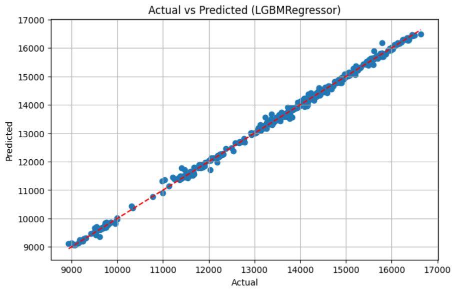
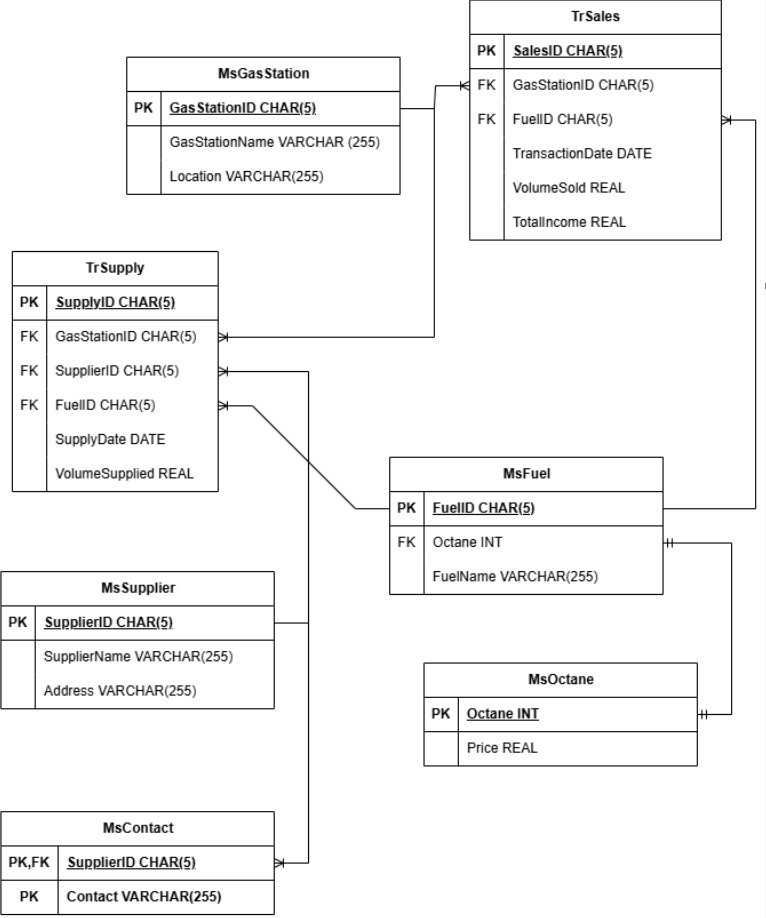
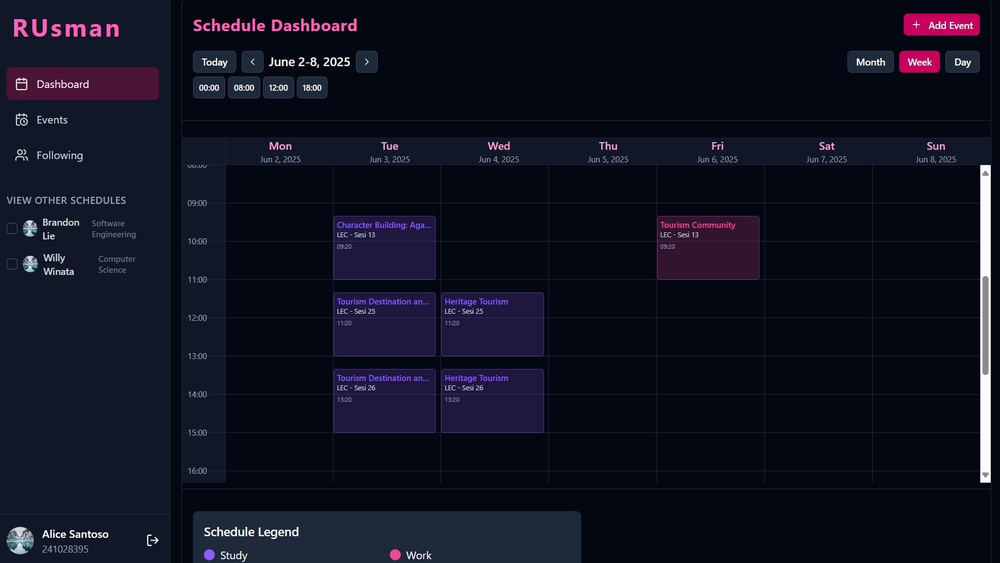

  <h1> 👋 Hi there, I’m Winsen Olando </h1>

#### 📫 Connect with me

---

### 💼 About Me

- Undergraduate _Computer Science Master Track_ at BINUS University
- Ex-BINUS SASC _Mentor Scholarship_ Awardee
- Focus on _Machine Learning, Data Mining, & Software Engineering_ Areas
- Recipient of _Special Award in Physics_ at the City Level, conferred by Ministry of Primary and Secondary Education
- _Chief Editor_ of Gema Dhammavaddhana Production

---

### 🛠 Tech Stack

   
  
   
  
   
  

---

### 🚀 Featured Projects

| Project                                                                                           | Description                        | Tech               | Key Methods / Models                                                                                | Image                                                                                                                                |
| ------------------------------------------------------------------------------------------------- | ---------------------------------- | ------------------ | --------------------------------------------------------------------------------------------------- | ------------------------------------------------------------------------------------------------------------------------------------ |
| [MetaFi](https://github.com/WinsenOlando/MetaFi)                                                  | Trading Platform Simulator         | C                  | Double Linked List, Insertion Sort, Finite State Machine, Trading Risk-Reward Calculation Algorithm |                                           |
| [Exchange Rate Forecast](https://github.com/WinsenOlando/USD-to-IDR-prediction)                   | Prediction USD to IDR              | Python             | Linear Regression, XGBoost Regression, LightGBM Regression                                          |                                       |
| [Fuel Supply Database](https://github.com/WinsenOlando/Database-Technology)                       | Database Management                | MySQL              | UNF-3NF                                                                                             | 
  
                             |
| [Mental Health Prediction](https://github.com/WinsenOlando/Mental-Health-Prediction)              | Text Analysis Using NLP            | Python             | XGBoost, Naive Bayes, Logistic Regression, Random Forest, Linear SVM                                | 
 
 |
| [RUsman](https://github.com/WillyWinata/SoftEngLec-Project-RUsman)                                | Collaborative Academic Scheduler   | React, Go, & MySQL | Domain Driven Design Architecture                                                                   |                                                          |
| [Corn Diseases Detection](https://drive.google.com/file/d/1aXwdUWcbRjE5whrvL5B5KnUANTzqeuFr/view) | Computer Vision Research & Project | Python             | YOLOv11 & DeepSeek R1                                                                               |                          |

---

### 🎯 My Interests

- Teaching & Mentoring: Database Technology, Algorithm and Programming, Data Structure, Natural Language Processing
- Artificial Intelligence: Machine Learning, Natural Language Processing, Computer Vision
- Software Development: Web Application Development, Database Design & Optimization

---

### 🧩 Fun Facts

- 🖥️ Completed an _internship_ at Sigma Komputer (1 month), assisted with printer troubleshooting, laptop installation, and CCTV setup.
- 💡 Achieved Second Runner-Up in _UPH Business Plan Competition_, sharpening my business and problem-solving skills.
- ✍️ Won 3rd Place in _National Vesak Article Writing Competition_ organized by Keluarga Buddhayana Indonesia, highlighting strong writing and communication skills.

---

### ✉️ Get in Touch

If you’d like to collaborate, chat about tech, or just say hi, feel free to reach out via LinkedIn or drop me an email at `[winsenolando@gmail.com]`

<picture>
  <source media="(prefers-color-scheme: dark)" srcset="https://raw.githubusercontent.com/WinsenOlando/WinsenOlando/output/pacman-contribution-graph-dark.svg">
  <source media="(prefers-color-scheme: light)" srcset="https://raw.githubusercontent.com/WinsenOlando/WinsenOlando/output/pacman-contribution-graph.svg">
  
</picture>

###
